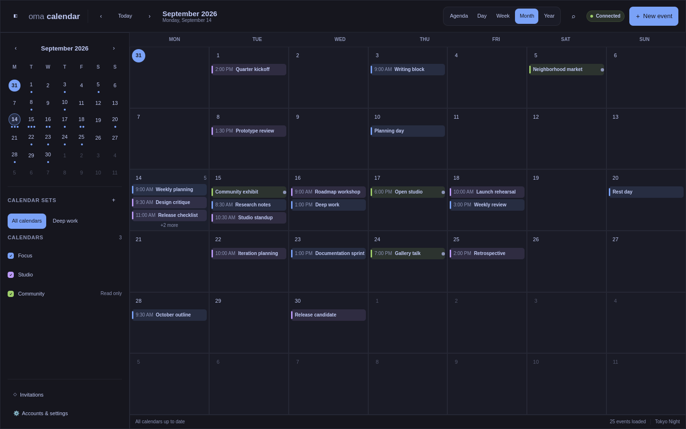
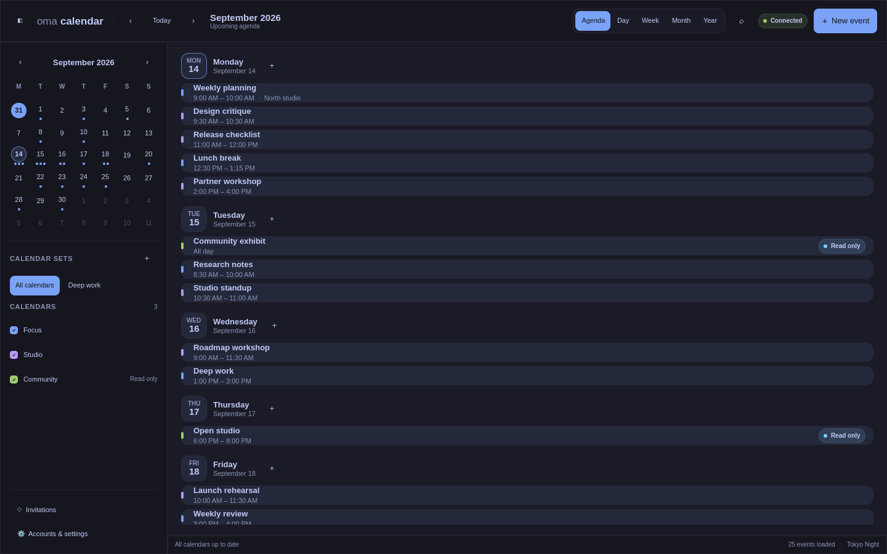
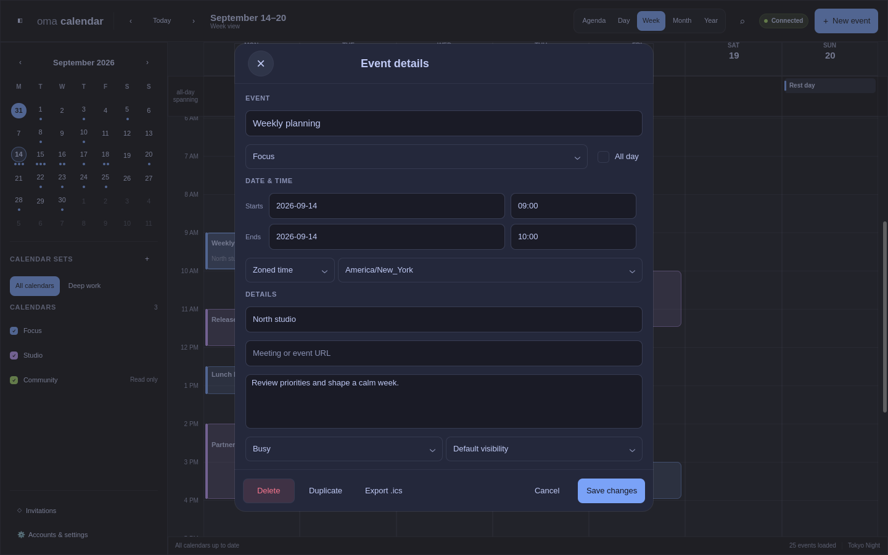

# OmaCalendar

OmaCalendar is a local-first, keyboard-oriented calendar for Omarchy Linux. It
provides fast, interaction-dense desktop calendar workflows without tasks,
booking services, natural-language entry, or an OmaCalendar cloud service. An
optional Quickshell companion is developed and released independently.

The next candidate is **`1.0.0-rc.4`**, being prepared after expanded acceptance
testing found correctness defects in RC3. It provides Arch, Ubuntu 26.04 `.deb`,
and Flatpak installation paths. See
[Install and update](docs/INSTALL.md), [the owner checklist](docs/OWNER_TESTING.md),
and [the stable preparation plan](docs/STABLE_PLAN.md). The public beta below
remains the last published release; pending stable checks have not been waived.

> [!WARNING]
> `1.0.0-beta.1` is an unsupported public-testing prerelease. Automated suites
> exercise the local database, provider mutation machinery, desktop, IPC,
> and reminders, but the full live-provider and stable owner-acceptance
> matrices are not complete. Use test or disposable calendars and never make a
> beta build the only copy of important calendar data.

## 1.0 scope

- Writable device-only, Google Calendar, and generic CalDAV calendars.
- Read-only HTTPS/webcal subscriptions and ICS import/export.
- Agenda, day, week, month, and year views.
- Timed, all-day, multi-day, recurring, invitation, RSVP, alarm, and conflict
  workflows.
- Calendar sets, indexed search, keyboard navigation, drag/drop, resize, undo,
  and explicit provider/error states.
- Localized date/time presentation in an English interface.

The optional Omarchy Quickshell companion uses the same local daemon but has an
independent version and release path.

For a concise installation and first-run walkthrough, see
[Getting started](docs/GETTING_STARTED.md).

Tasks, Microsoft/Exchange, hosted scheduling, weather, maps, travel time,
attachments, video-provider authorization, and remote calendar creation are
not part of the 1.0 scope. See the decision-complete [1.0 roadmap](docs/PLAN.md)
for the full boundary and release gates.

## Screenshots

All screenshots use an isolated capture profile with synthetic calendars and
events; no maintainer account or calendar data is included.



| Week view with overlapping events | Scrollable agenda |
|---|---|
|  |  |



## Beta status

[OmaCalendar `1.0.0-beta.1` is published](https://github.com/brdweb/omacalendar/releases/tag/v1.0.0-beta.1)
using IPC 2 and database schema 2. The release includes verified native Arch,
binary and source packages, checksums, SPDX SBOM, GitHub attestations, and a
signed `RELEASE-ACCEPTANCE.md` receipt with the explicitly accepted beta limitations.
Local automated coverage currently includes the schema transition,
daemon and provider contracts, local event/calendar workflows, reminders,
recurrence, search, import/export, conflict handling, and desktop models. A
staged `/usr` install and uninstall also pass. Narrow live development checks
have passed against an isolated Radicale 3.8.0 instance and a public NASA HTTPS
ICS feed, including persisted restart and completed refresh.

The candidate passes all 22 local GCC tests, including the reference-hardware
performance gate. Clean hosted GCC Debug, Clang RelWithDebInfo, ASan/UBSan,
and current-Arch package baseline jobs also pass. QML lint is clean and desktop
smoke tests pass at scale factors 1, 1.25, and 2. The enforced 100,000-event
reference-Omarchy run of the downloaded candidate measured p95 latency of
42.968 ms for agenda, 5.571 ms for indexed search, 76.101 ms for a full widget
snapshot, and 0.737 ms for an
unchanged snapshot. Exact commits and workflow links are recorded in the
[beta acceptance record](docs/releases/1.0.0-beta.1.md).

These results do not qualify stable 1.0. Live Google writes, the full Radicale
matrix, Nextcloud, Fastmail, authenticated ICS, a clean current-Omarchy VM,
complete desktop workflow testing, and the final owner acceptance pass remain
open.
The detailed evidence and unchecked gates are maintained in [the implementation
plan](docs/PLAN.md).

Google has approved OmaCalendar's OAuth branding and requested Calendar scopes.
The owner reports successful post-approval external-account login and sync.
The full exact-candidate write, token-persistence, and restart matrix remains
unverified and is explicitly accepted as a first-beta limitation. Local calendars,
CalDAV, ICS, and the widget's connection to the local OmaCalendar daemon do not
depend on Google authorization.

## Architecture

`omacalendard` is the only process allowed to write the SQLite database, access
credentials, or communicate with providers. The Qt Quick application and
`omacalendarctl` are clients of its versioned user-local IPC API. The
optional Quickshell plugin lives in the separate
`omacalendar-widget` repository and has no database, credential, or provider
access. Its releases are independent and compatibility is negotiated through
the IPC protocol and advertised capabilities.

```text
Local / Google / CalDAV / ICS
              |
        omacalendard ---- Secret Service
              |
          SQLite + local IPC
              |
       +------+------+
       |             |
    desktop app   Quickshell widget
```

Calendar views read cached data and do not wait for a provider. Credentials
belong in Secret Service and are never stored in SQLite. More detail is in
[the architecture guide](docs/ARCHITECTURE.md) and [IPC documentation](docs/IPC.md).

Installed builds enable `omacalendard.socket`. The desktop UI does not need to
be open: the first widget or CLI connection starts the daemon on demand, and
the widget's initial snapshot comes from the local cache rather than waiting
for a provider sync.

## Build from source

OmaCalendar uses C++20, CMake 3.28+, Ninja, Qt 6.9+, libical 4.0+, and Secret Service.
On Omarchy/Arch Linux:

```bash
omarchy pkg add cmake ninja gcc qt6-base qt6-declarative \
  qt6-networkauth libical libsecret pkgconf
cmake -S . -B build -G Ninja \
  -DCMAKE_BUILD_TYPE=RelWithDebInfo \
  -DCMAKE_INSTALL_PREFIX=/usr/local
cmake --build build --parallel
ctest --test-dir build --output-on-failure
packaging/release/check-qmllint.sh build
```

Run the development binaries without installing:

```bash
./build/omacalendard &
./build/src/app/omacalendar
./build/omacalendarctl system.info
```

Exact binary locations can vary with the CMake generator. For a staged
development package installation configured for `/usr`:

```bash
cmake -S . -B build-release -G Ninja \
  -DCMAKE_BUILD_TYPE=Release \
  -DCMAKE_INSTALL_PREFIX=/usr \
  -DOMACALENDAR_VERSION_SUFFIX=-beta.1
cmake --build build-release --parallel
DESTDIR="$PWD/stage" cmake --install build-release
packaging/release/verify-install.sh "$PWD/stage"
```

The systemd user unit is generated for the CMake configure-time prefix. Do not
configure for `/usr/local` and later override the install prefix to `/usr`.
After installing, activate the on-demand backend with:

```bash
systemctl --user daemon-reload
systemctl --user enable --now omacalendard.socket
```

## Install the beta Arch package

When `v1.0.0-beta.1` is published, its GitHub release includes a native package
for current Omarchy on x86-64. Download the package and checksum file into an
empty directory, verify the exact package entry, then install it:

```bash
curl -LO https://github.com/brdweb/omacalendar/releases/download/v1.0.0-beta.1/omacalendar-1.0.0beta1-1-x86_64.pkg.tar.zst
curl -LO https://github.com/brdweb/omacalendar/releases/download/v1.0.0-beta.1/SHA256SUMS
grep ' omacalendar-1.0.0beta1-1-x86_64.pkg.tar.zst$' SHA256SUMS | sha256sum --check
gh attestation verify ./omacalendar-1.0.0beta1-1-x86_64.pkg.tar.zst \
  --repo brdweb/omacalendar
gh attestation verify ./omacalendar-1.0.0beta1-1-x86_64.pkg.tar.zst \
  --repo brdweb/omacalendar \
  --predicate-type https://spdx.dev/Document/v2.3
yay -U ./omacalendar-1.0.0beta1-1-x86_64.pkg.tar.zst
systemctl --user daemon-reload
systemctl --user enable --now omacalendard.socket
systemctl --user try-restart omacalendard.service
```

The `gh attestation verify` steps use the optional GitHub CLI to verify build
provenance and the SPDX SBOM attestation; the exact `SHA256SUMS` entry must pass
regardless. GitHub release
packages do not add a pacman repository or automatic update channel. Install a
newer release package explicitly when one is published. The source and binary
AUR recipes remain prepared for publication when new AUR account registration
is available again.

## Testing providers

- [Google Calendar credential checkpoint](docs/GOOGLE_TESTING.md)
- [CalDAV provider matrix](docs/CALDAV_TESTING.md)

Never place credentials in the repository, fixtures, logs, issue reports, or
shell history. Live-provider suites must use dedicated test accounts.

## Project policies

- [Contributing](CONTRIBUTING.md)
- [Security](SECURITY.md)
- [Support and current limitations](SUPPORT.md)
- [Compatibility matrix](docs/COMPATIBILITY.md)
- [Backup and recovery](docs/BACKUP_AND_RECOVERY.md)
- [Privacy](docs/PRIVACY.md)
- [Release procedure](docs/RELEASE.md)
- [Uninstall and data removal](docs/UNINSTALL.md)
- [Changelog](CHANGELOG.md)

The release workflow produces checksummed archives, an SPDX SBOM, and GitHub
artifact attestations. `1.0.0-beta.1` is always marked as a GitHub prerelease;
stable `1.0.0` remains blocked until every stable release gate and the owner
acceptance pass are complete.

## Project website

- [OmaCalendar project site](https://omacalendar.brdweb.com/)
- [Privacy policy](https://omacalendar.brdweb.com/privacy.html)
- [Terms of use](https://omacalendar.brdweb.com/terms.html)

OmaCalendar is released under the [MIT License](LICENSE).
